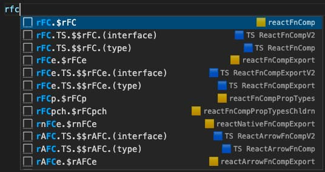
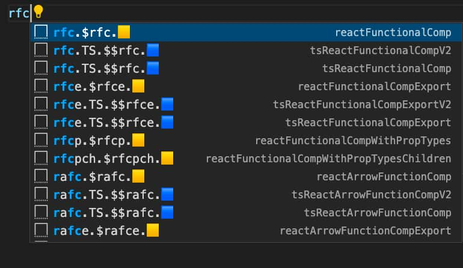

# Change Log

All notable changes to the "vscode-js-ts-react-nextjs-snippets" extension will be documented in this file.

## 1.12.0 <small>- 2022/09/07</small>

- Improved JSON stringify/parse wrapper-snippet
- Added JSON stringify/parse snippet (`jstr`, `jprs`)
- Added typeof snippet (`typeof`)

## 1.11.0 <small>- 2022/09/06</small>

- Added [Redux](https://react-redux.js.org/) snippet (`rxDispatch`, `rxStore`, `rxSlice`)
- Improved React TS snippets

## 1.10.0 <small>- 2022/07/19</small>

- Added React with [Emotion CSS](https://emotion.sh/docs/introduction) snippet (`emoRFC`, `emoRFCe`, `emoRAFC`, `emoRAFCe`)
- Added React element with `dangerouslySetInnerHTML` prop

## 1.9.0 <small>- 2022/06/21</small>

- Added React functional component without export snippet (`rFCne`, `rAFCne`)
- Improved snippets prefix and snippets order  
  

## 1.8.0 <small>- 2022/06/12</small>

- Improved snippet name & prefix

## 1.7.0 <small>- 2022/06/11</small>

- Added [React Native](https://reactnative.dev/) snippets
- Improved Jest snippets

## 1.6.0 <small>- 2022/06/10</small>

- Added [SWR](https://swr.vercel.app/) snippets
- Added Next.js dynamic import snippet (as wrapper-snippet)
- Updated React-component snippets
- Updated React-hook snippet's tabstop
- Updated React Query snippets

## 1.5.0 <small>- 2022/06/07</small>

- Updated wrapper-snippet prefix

## 1.4.0 <small>- 2022/05/29</small>

- Added HOC snippet
- Updated React TS snippet: prefer `type` over `interface`
- Fixed inconsistent indentation

## 1.3.0 <small>- 2022/05/27</small>

- Fixed JS-TS prefix inconsistencies on Next.js snippets
- Improved Next.js snippet prefix

## 1.2.0 <small>- 2022/05/27</small>

- Updated snippet's prefix emoji: 🟨 for JavaScript, and 🟦 for TypeScript  
  

## 1.1.0 <small>- 2022/05/25</small>

- Added async function snippet
- Added react conditional-syntax wrapper-snippets
- Added regular string to template literals wrapper-snippets

## 1.0.0 <small>- 2022/05/18</small>

- Added vanilla JS snippets
- Added React snippets
- Added [Next.js](https://nextjs.org/) snippets
- Added [React Query](https://react-query.tanstack.com/) snippets
- Added [Jest](https://jestjs.io/) snippets
- Added [React Hook Form](https://react-hook-form.com/) snippets
- Added [Zustand](https://www.npmjs.com/package/zustand) snippets
- Added wrapper snippets
- Added generate-from-clipboard snippets
