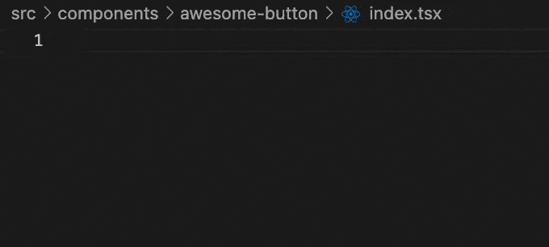
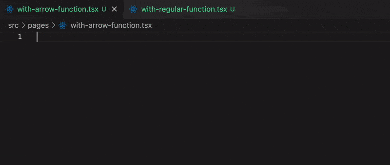
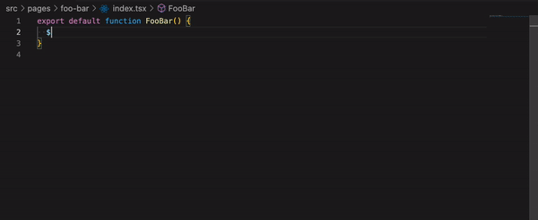
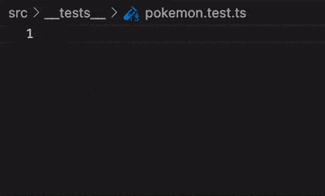
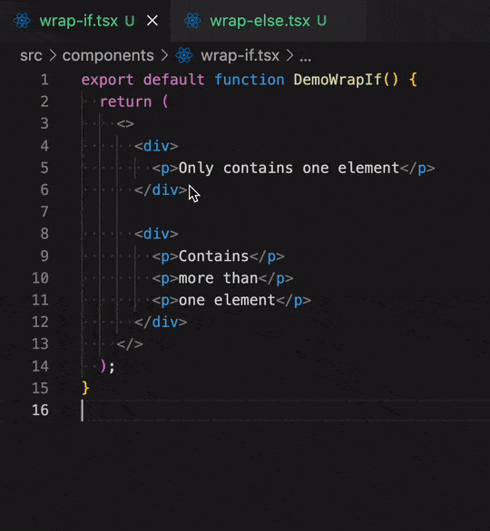
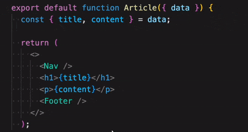
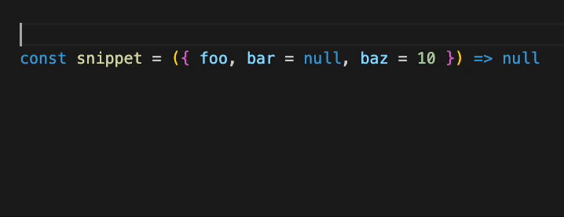
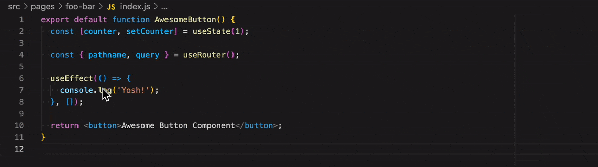
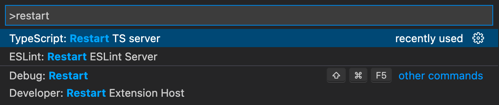

# VSCode Snippets for JS/TS, React/Next.js, React Query, SWR, Redux, Jest, React Hook Form, Emotion CSS, & many more

Write code faster using snippets!  
Just type the snippet keyword (for example, type `rfc`), a suggestion will appear, then press `Tab`.  
If there is no suggestion, use `Ctrl`+`Space` to open it.

## Usage

- You can just type directly 👉 `rfc`
- You can also use `$` prefix 👉 `$rfc`
- You don't need to write complete snippet prefix. For example, there is `useState` snippet, you can just type `useSt` and the suggestion will appear.

For TypeScript snippets:

- You can add `ts` at the end 👉 `rfc` for JS became `rfcts` for TS
- Or you can use `$$` prefix 👉 `$$rfc`

## List All Available Snippets

- Type `$` (and press `Ctrl`+`Space` if necessary), then check all available snippets.
- Check React snippets using `$r`
- Check [Next.js](https://nextjs.org/) snippets using `$n`
- Check [React Native](https://reactnative.dev/) snippets using `$rn`
- Check [React Router](https://reactrouter.com/) snippets using `$rou`
- Check [React Query](https://react-query.tanstack.com/) snippets using `$rq`
- Check [SWR](https://swr.vercel.app/) snippets using `$swr`
- Check [Redux](https://react-redux.js.org/) snippets using `$rx`
- Check [Jest](https://jestjs.io/) snippets using `$t`
- Check [React Hook Form](https://react-hook-form.com/) snippets using `$rhf`
- Check [Zustand](https://www.npmjs.com/package/zustand) snippets using `$zu`
- Check [Emotion CSS](https://emotion.sh/docs/introduction) snippets using `$emo`
- Check wrapper-snippets using `$_`

### 👉 [See All Available Snippets Here!](./snippets.md) 👈

## Examples

## Wrapper Snippets

Type `_` or `$_` to check all available wrapper snippets

## Generate-from-Clipboard Snippets

Select text and copy it 📋 write snippet and boom! 🪄💥

## Why There Are No Snippet for Import? 🤔

Because you might not need that. VSCode has built-in feature for auto-import your modules. Use `Ctrl`+`Space` on your variable and a popup will appear.

If auto import doesn't appear, open command palette (`Ctrl`+`Shift`+`P`) and select restart TS server.

---

## Donation

 

