First of all, you need to understand that we don't provide a snippet for importing your package like any other VSCode snippets extention.

`imr` → `import React from 'react'`

👆 We don't do it here.

We encourage you to use the built-in auto import from VSCode.  
Use `Ctrl`+`Space` on your variable and a popup will appear.

If auto import doesn't appear, open command palette (`Ctrl`+`Shift`+`P`) and select restart TS server.

---

Okay, here we go...

# All Available Snippets

## Vanilla JavaScript

### Console

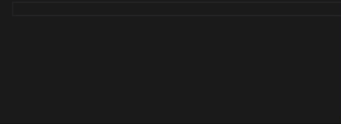

### setTimeout & setInterval

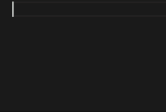

### Arrow Function

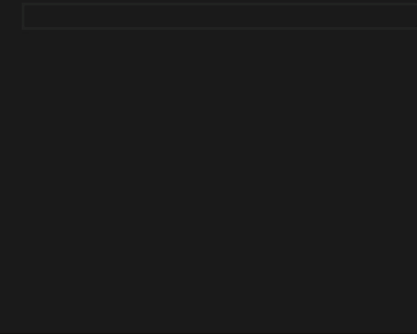

### JSON.stringify & JSON.parse

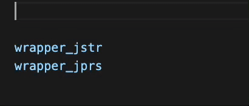

### typeof

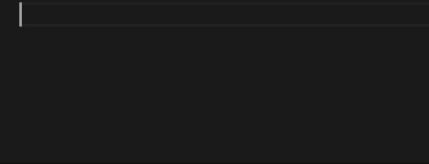

## React

### Component (Regular Function)

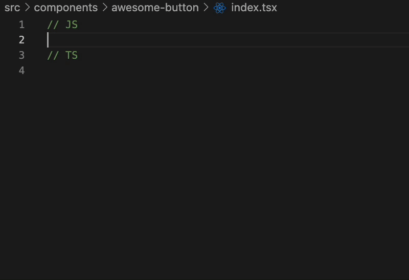

### Component (Arrow Function)

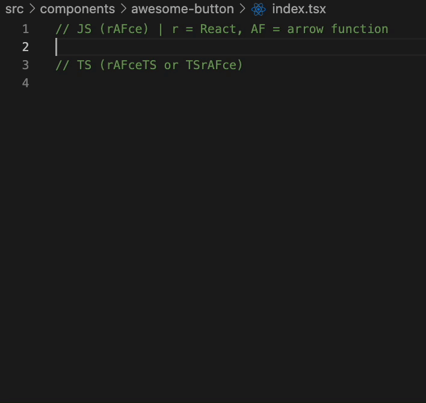

### React Hooks

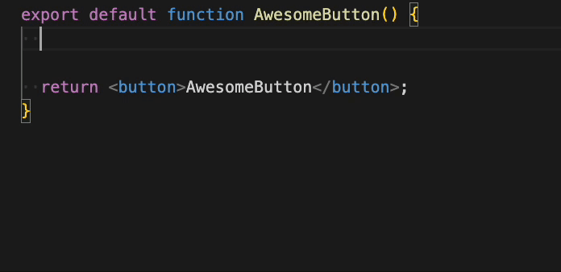

### JSX Wrapper

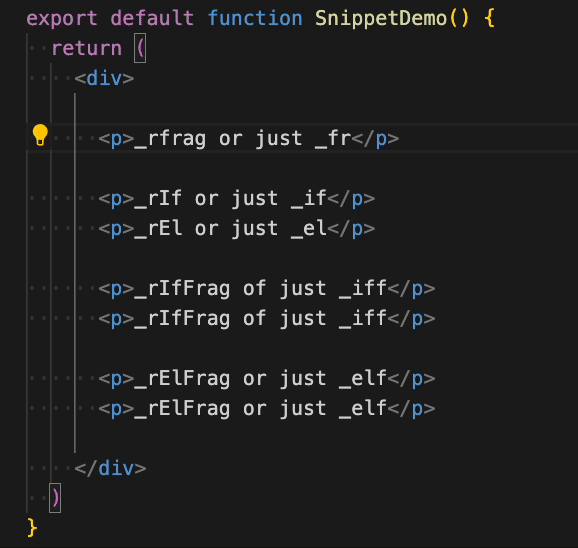

### React Lazy

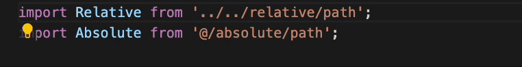

### React dangerouslySetInnerHTML

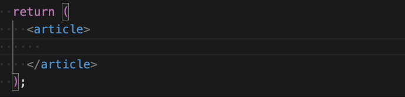

## Next.js

### Next.js getServerSideProps, getStaticProps, getStaticPaths

### Next.js Custom Document

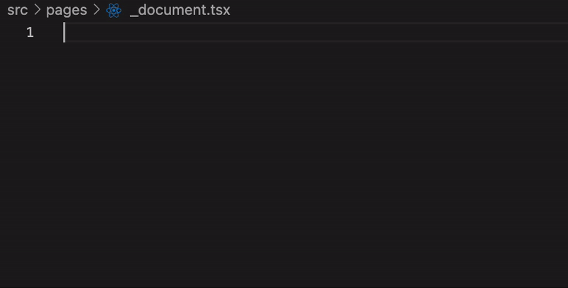

### Next.js Router

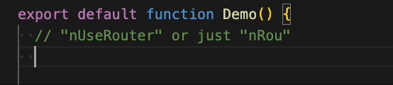

### Next.js Dynamic Import

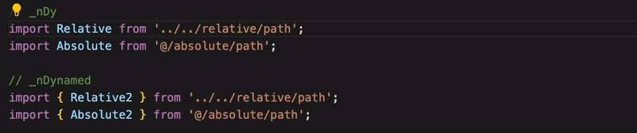

## React Native

### React Native Component

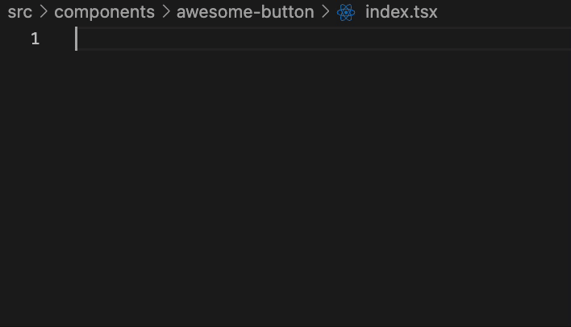

## React Router

### Create Router

### React Router Hooks

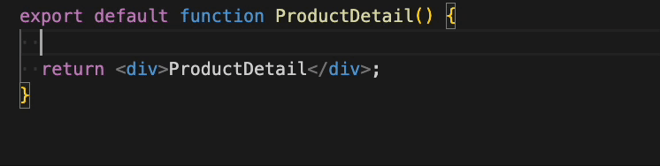

## React Query

### React Query

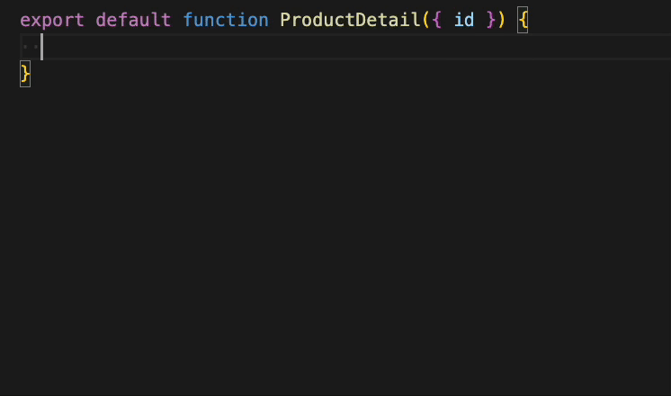

## SWR

### SWR Hook

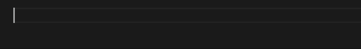

## Redux

### Redux Store

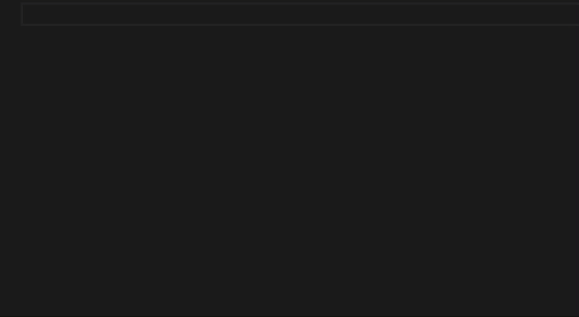

### Redux Slice

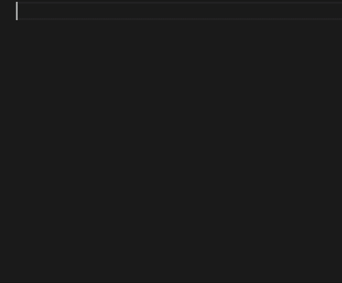

### Redux Hooks

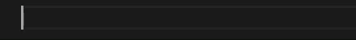

## Testing

### Test Block

### Before & After

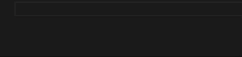

## React Hook Form

### React Hook Form

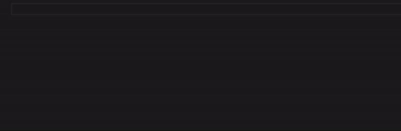

## Zustand

### Zustand Config

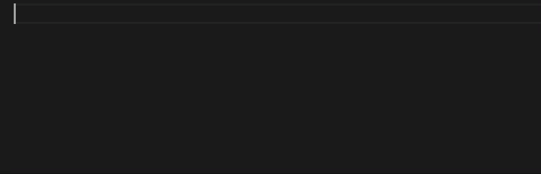

### Zustand Hooks

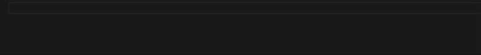

## Emotion CSS

### Emotion CSS in React Component

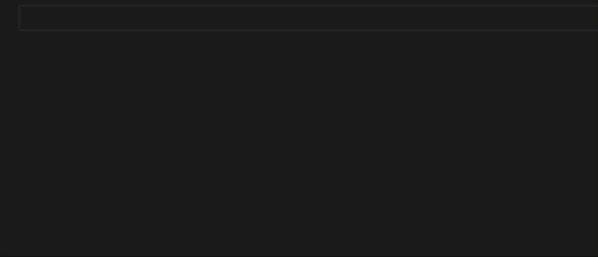

## TypeScript

### Generate Types/Interface from Clipboard

